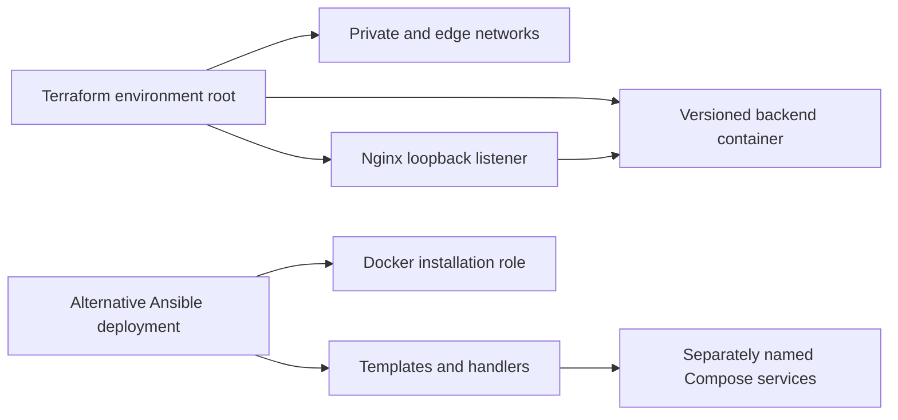
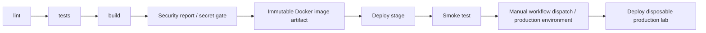

# devops-iac-cicd

Production-like homelab project created to practice and demonstrate DevOps/SRE engineering patterns. It is not presented as commercial production experience.

A complete local release workflow with Terraform-owned Docker infrastructure and an alternative Ansible deployment. No paid cloud resources are provisioned. The small version-reporting HTTP service makes release identity testable; the engineering scope is infrastructure delivery, not application complexity.





## Requirements and local start

Docker Engine, Compose, Python 3.11, Make, Terraform >=1.6, shellcheck, yamllint, hadolint and gitleaks. `make install` installs the Python tools, including Ansible. No repository credentials are needed locally.

```bash
make install test
make build
make validate
make deploy ENV=dev
python3 scripts/smoke.py http://127.0.0.1:8081
terraform -chdir=terraform/environments/dev plan
```

`make up smoke` is an alternative Compose quick start on port 8081; stop it with `make down` before Terraform dev. Do not let two tools own the same names or ports. Terraform creates backend compute, Nginx compute and isolated networks; backend has no published port or internet route. Nginx publishes only loopback. Dev/stage/prod use separate state roots, resource names and ports 8081/8082/8083.

```bash
make deploy ENV=stage IMAGE=iac-backend:local
python3 scripts/smoke.py http://127.0.0.1:8082
make ansible
make ansible
curl http://127.0.0.1:8084/release
```

Ansible's second unchanged run should report `changed=0`; verify it yourself rather than assuming idempotency from module choice. Docker installation is disabled locally. To install Docker on a disposable Ubuntu 24.04 host, supply your real inventory and set `install_docker=true`, `deploy_root=/opt/iac-dev` with a writable directory, and appropriate privilege escalation. No guessed SSH host is committed. The node exporter measures the Docker VM in macOS, not the physical Mac. Linux package installation is a separate validation boundary.

## CI/CD and environment strategy

`.github/workflows/pipeline.yml` runs lint, tests, image build, Trivy report and blocking secret scan, then deploys stage and smoke-tests it. The tar artifact preserves the exact commit-tagged image across independent runners. Production requires manually dispatching the workflow on main with `approve_production=true`, and uses the `production` environment. Configure required reviewers in GitHub's environment settings for independent approval. YAML cannot create that protection rule. Without it, the explicit dispatcher approval is the only gate. See [GitHub environments](https://docs.github.com/en/actions/reference/workflows-and-actions/deployments-and-environments).

Stage/prod are short-lived Docker infrastructure on the job's runner and are destroyed at job completion; this is a delivery exercise, not a persistent hosted service. A real deployment requires trusted deployment runners or remote Docker access and persistent remote state. Trivy produces a non-blocking vulnerability report because upstream base-image findings need triage; secret detection blocks. No check badge is shown before the repository and its checks exist.

## Remote state and secrets

Separate local states are ignored by Git. `terraform/remote-state.tf.disabled` supplies an HTTP backend block to enable in each environment when a state service exists. Configure `-backend-config=address=...` using your own endpoint, plus lock_address/unlock_address and HTTP authentication environment variables. Do not commit credential-bearing backend arguments. The required endpoint is deployment-specific and is not guessed here. State migration requires a backup, restricted ACLs, encryption, locking and a restore rehearsal. Never use a shared state key for stage and prod.

The sample service needs no password. `.env.example` lists deployment configuration, not secrets. SSH keys and registry/state credentials belong in protected CI secrets or an external secret store. Remote Docker grants root-equivalent access: use SSH/TLS and a dedicated host, never an unauthenticated TCP listener. Loopback publishing and internal Docker networking are local security rules, not a cloud VPC/firewall implementation; Docker-published ports can bypass host UFW rules.

## Rollback and disaster recovery

Build immutable tags, record the accepted image in the release log and retain it. Reapply a previous tested image:

```bash
make build IMAGE=iac-backend:baseline
make deploy ENV=stage IMAGE=iac-backend:baseline
make build IMAGE=iac-backend:candidate
make deploy ENV=stage IMAGE=iac-backend:candidate
make rollback ENV=stage IMAGE=iac-backend:baseline
```

Rollback recreates backend and may briefly interrupt requests; this is not zero-downtime blue/green. Terraform state does not restore application data. This stateless service's recovery needs the image, configuration and state backup. For persistent extensions specify RPO/RTO, snapshot policy and restoration tests; this project claims none.

## Troubleshooting and cleanup

`terraform plan` should be empty after apply. A missing local image requires `make build`; daemon errors require a running Docker Engine. Check `docker logs iac-dev-nginx` and the release endpoint before assigning cause. Port conflicts usually mean Compose or another environment is already running. Do not delete state to resolve drift; inspect/import/reconcile resources deliberately.

```bash
terraform -chdir=terraform/environments/dev destroy
terraform -chdir=terraform/environments/stage destroy
terraform -chdir=terraform/environments/prod destroy
docker compose -f artifacts/ansible-dev/compose.yaml down
```

See [VALIDATION.md](VALIDATION.md) and [docs/decisions.md](docs/decisions.md). This project demonstrates modular IaC, environment separation, idempotent configuration, immutable image promotion, smoke checks, explicit approval and rollback boundaries.

See [local image security findings](docs/security-scan.md) and [publishable repository tree](TREE.txt).
